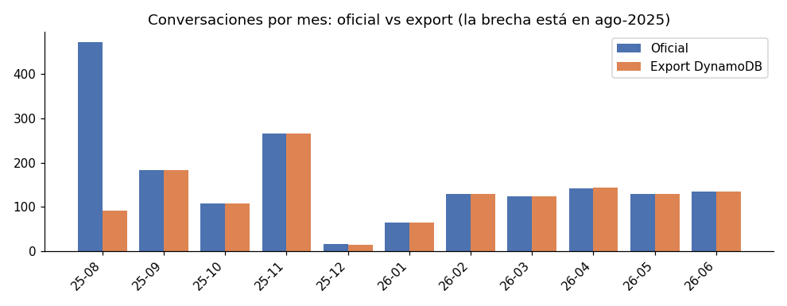
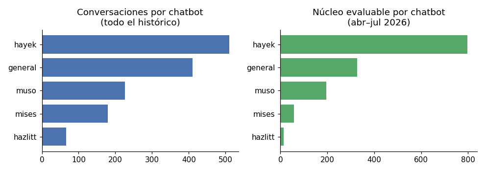
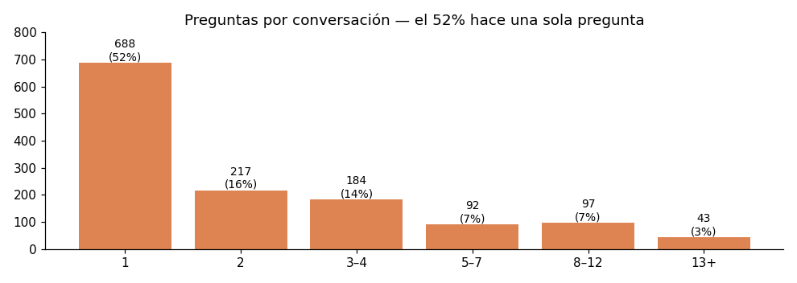
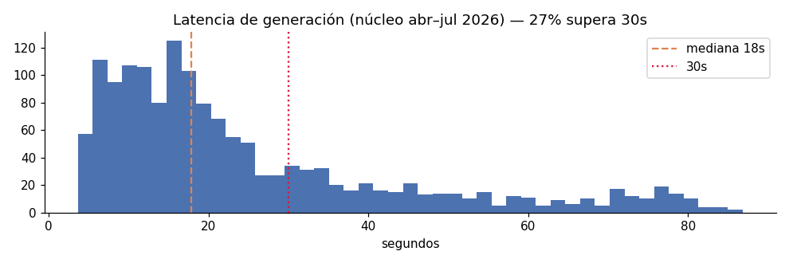

# Bloque 1 — Informe de analítica de uso
**Evaluación del Chatbot CHH (UFM) · 17 de julio de 2026**
**Base:** export anonimizado de DynamoDB (1.391 conversaciones, 4.220 consultas, ago-2025 → jul-2026) + trazas LangSmith + estadísticas oficiales.

---

## 1. Volumen y estacionalidad

El uso sigue con claridad el calendario académico: picos en los arranques e intensificaciones de semestre (ago-2025: 472 conversaciones oficiales; nov-2025: 266; y un segundo ciclo feb–jun 2026 estable en 124–143/mes) y valles en vacaciones (dic-2025: 16; ene-2026: 65). El uso se concentra de martes a viernes y en dos franjas horarias (13–15 h y 17–18 h), consistente con uso post-clase.

La brecha entre export y oficial se concentra íntegramente en agosto-2025 (ver Nota de Calidad de Datos): la analítica de ese mes de lanzamiento se apoya solo en los totales oficiales.

**Lectura para la evaluación:** el sistema tiene demanda real y recurrente ligada a la docencia, no un uso anecdótico. La retención mensual de usuarios (28–53 usuarios/mes en 2026 frente a 169 en el lanzamiento) sugiere que tras la novedad queda un núcleo de usuarios habituales; la prueba con estudiantes (Fase 2) debería explorar por qué el resto no vuelve.

## 2. Uso por chatbot

Hayek domina el uso histórico (510 conversaciones, 37%), seguido de la colección general (410, 29%), muso (226), mises (179) y hazlitt (66, 5%). En el periodo reciente (núcleo abr–jul 2026) la concentración se acentúa: hayek + general acumulan el 74% de las interacciones evaluables.

**Lectura:** el patrón refleja casi con seguridad qué cursos incorporan el bot a su docencia. Hazlitt está infrautilizado (y por ello casi no es evaluable con datos históricos: solo 13 interacciones en el núcleo). Vale la pena preguntar al CHH si es falta de difusión, de encaje curricular o de utilidad del corpus.

## 3. Profundidad de las conversaciones

- Mediana de **1 pregunta por conversación**; media 3,2. El **52% de las conversaciones tiene una sola pregunta** y el 18% tiene 5 o más (máximo: 66).
- Además hay **70 conversaciones vacías** (5%): chat abierto sin llegar a escribir.
- Las respuestas son extensas: mediana 2.589 caracteres, p90 7.272 (≈1,5 páginas).

**Lectura:** conviven dos modos de uso muy distintos — consulta puntual tipo "diccionario" (mayoritaria) y sesión de estudio larga (minoritaria pero intensiva, típicamente en época de parciales). Las respuestas largas por defecto encajan con el segundo modo, pero pueden ser excesivas para el primero; es una hipótesis a contrastar en la prueba con estudiantes.

## 4. Qué se pregunta

Tipología (heurística por patrones, sobre 4.220 consultas; categorías no excluyentes):

| Tipo de consulta | % |
|---|---|
| Explicación conceptual ("qué es", "explica", "define") | 29% |
| Ayuda de estudio (resúmenes, quiz, parcial, guías) | 8% |
| Comparación/relación entre conceptos o autores | 8% |
| Posición del autor ("qué piensa X sobre…") | 8% |
| Aplicación a casos actuales o de Guatemala | 4% |
| Pegado de material largo para trabajarlo (>2.000 caracteres) | 3% |
| Peticiones de formato (amplía, resume, tabla) | 1% |

Temas más frecuentes: libertad (12%), intervención/Estado (8%), ley y derecho (8%), mercado (7%), precios (6%), capital e interés (6%), dinero y banca (6%).

**Dos patrones de uso emergentes que merecen atención:**

1. **El bot como compañero de parcial.** Las conversaciones largas se disparan en semanas de examen, con peticiones de quiz, autoevaluación y repaso multitema. Es el caso de uso de mayor valor añadido y debería pesar en el golden set.
2. **El bot como corrector/procesador de material propio.** Un 3% de consultas pegan transcripciones, apuntes o ensayos para que el bot los complete o critique. Esto sale del diseño RAG (la respuesta se apoya en el material pegado, no en el corpus) y conviene decidir explícitamente si es un uso deseado.

## 5. Preguntas recurrentes y demanda insatisfecha

Entre las preguntas repetidas destacan varias formulaciones casi idénticas de conceptos nucleares (libertad negativa, coacción, gobierno mayoritario en *Fundamentos de la libertad*, rol de los precios en Ayau) — candidatas naturales al golden set porque son lo que los estudiantes realmente preguntan.

Caso singular: **11 peticiones del enlace al libro "How a Fiat Standard Works"** (aparentemente material de un curso) que el bot no puede satisfacer. Es demanda insatisfecha concreta: o se incorpora el documento al corpus o se instruye al bot para redirigir.

## 6. Fuera de dominio, manipulación y comportamiento del bot

- **Intentos de cambio de rol o manipulación: 20 consultas** (0,5%). La mayoría son benignas ("actúa como un profesor experto en teoría austriaca…" para mejorar la respuesta académica); el único intento lúdico claro es "actúa como un chef de cocina italiana y da una receta" (4 veces, mismo patrón). También hay curiosidades fuera de dominio ("cuéntanos un chiste", "¿viste que sacaron una película en tu honor?" — referida al documental sobre Ayau).
- **Señal de integridad académica:** varias consultas piden directamente respuestas de parciales ("tengo preguntas del segundo parcial…", "¿tienes acceso al primer parcial…?"). El bot observado no facilita el examen en sí, pero sí resuelve las preguntas conceptuales. Es una zona gris que el CHH debería normar (¿está bien que resuelva la guía del parcial?), y un escenario obligatorio para la batería de robustez del Bloque 5.
- **Rechazos o "sin información": 72 respuestas (1,8%)**, concentradas en muso (41). En 19 de 72 casos el usuario abandona la conversación tras el rechazo. La sobrerrepresentación de muso sugiere corpus más limitado o preguntas más personales/biográficas sobre Ayau; a verificar en el Bloque 2.
- **Quejas o correcciones explícitas del usuario: 16 turnos (0,4%)** — bajo, aunque este indicador infraestima la insatisfacción (el usuario insatisfecho suele irse sin quejarse). Se detectó al menos un caso donde el bot admite: *"Debo corregir lo que afirmé antes…"* tras el desafío del usuario — señal directa de alucinación previa que el Bloque 2 medirá de forma sistemática.

## 7. Métricas operativas (núcleo abr–jul 2026)

| Métrica | Mediana | p90 |
|---|---|---|
| Latencia de generación | 17,9 s | 56,0 s |
| Tokens de entrada (prompt con 25 fragmentos) | 17.468 | 69.185 |
| Tokens de salida | 862 | 2.912 |
| Coste estimado por respuesta (sin cache) | ~$0,07 | — |

- **El 27% de las respuestas tarda más de 30 s y el 8,7% más de 60 s.** Para un estudiante esperando, es una fricción real y probablemente explica parte de los abandonos tras una sola pregunta.
- El prompt mediano de 17k tokens está dominado por los 25 fragmentos recuperados. Junto con la cola de fragmentos de baja afinidad detectada (p10 de score: 0,44), apunta a la hipótesis de mejora ya anotada: **menos fragmentos mejor filtrados (umbral de score o reranking) podrían reducir latencia y coste sin perder calidad** — exactamente lo que el Bloque 2 permitirá contrastar con datos.
- El coste oficial acumulado ($647,51 por 5.005 consultas ≈ $0,13/consulta) es coherente con la estimación desde trazas, moderado por el prompt caching documentado.

## 8. Síntesis: implicaciones para el resto de la evaluación

1. **Golden set (Bloque 3):** construirlo desde las preguntas reales — conceptos de libertad, coacción, precios, capital/interés y ley dominan la demanda; incluir el modo "ayuda de parcial" (quiz, comparaciones) además de la definición simple. Sobreponderar mises y hazlitt para compensar su escasez histórica.
2. **Evaluación del motor (Bloque 2):** priorizar la verificación de fidelidad en hayek y general (74% del uso); investigar los rechazos de muso; medir si la cola de fragmentos de bajo score contribuye o estorba.
3. **Robustez (Bloque 5):** incluir los escenarios reales observados — cambio de rol (chef), petición de material de examen, pegado de material ajeno al corpus, preguntas sobre la película/biografía de Ayau.
4. **Prueba con estudiantes (Fase 2):** explorar la caída de usuarios tras el lanzamiento, la utilidad de las respuestas largas frente a consultas puntuales y la fricción de latencia.
5. **Decisiones de producto para el CHH:** normar el uso en parciales; decidir si el "modo corrector de apuntes" es bienvenido; resolver la demanda del libro solicitado 11 veces; investigar la infrautilización de hazlitt.
